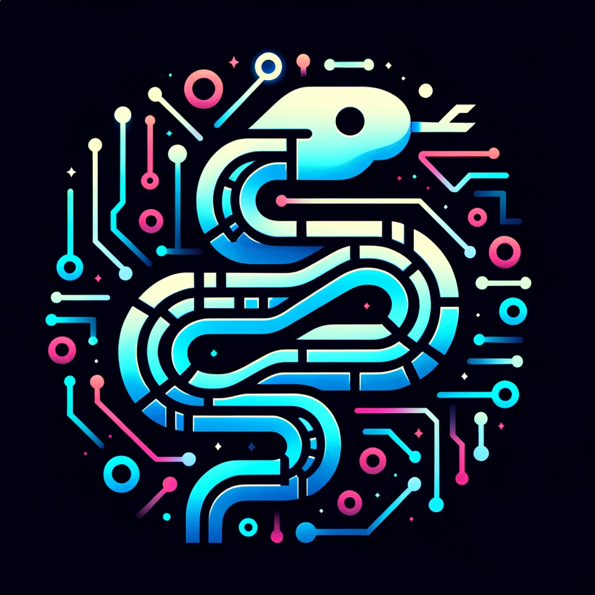

# Project-Based Python Learning Course

Welcome to the Project-Based Python Learning Course! This repository, curated by [dsj7419](https://github.com/dsj7419), is designed to provide a hands-on and engaging approach to learning Python through practical projects.

## About The Course

This course is structured into different modules, each focusing on a particular topic in Python and associated with a project to provide a practical application of the concepts learned.

## How to Use This Repository

- **Learners:** Navigate through the modules, read the concepts, and work on projects on the [course website](https://dsj7419.github.io/python-learning-by-projects/). Each lesson is available as a separate page, and quizzes are integrated into the web interface for a seamless learning experience.
- **Contributors:** Feel free to improve existing content, add new projects, or enhance documentation by interacting with the [GitHub repository](https://github.com/dsj7419/python-learning-by-projects).

## Getting Started

[Start your Python journey here](https://dsj7419.github.io/python-learning-by-projects/01-getting-started/) by setting up your development environment and working on the first project!

## Course Structure

### Beginning Python

1. **[Getting Started](https://dsj7419.github.io/python-learning-by-projects/01-getting-started/)**
   - Environment Setup, Writing a Python Script
   - *Project: Hello, World! & Magic 8-Ball Simulator*

2. **[Variables and Data Types](https://dsj7419.github.io/python-learning-by-projects/02-variables-and-data-types/)**
   - Variables, Data Types
   - *Project: Greeting Card*

3. **[Control Flow](https://dsj7419.github.io/python-learning-by-projects/03-control-flow/)**
   - Conditionals, Loops
   - *Project: Adventure Game*

4. **[Data Structures](https://dsj7419.github.io/python-learning-by-projects/04-data-structures/)**
   - Lists, Dictionaries, Sets
   - *Project: To-Do List Application*

5. **[Modular Programming](https://dsj7419.github.io/python-learning-by-projects/05-modular-programming/)**
   - Benefits, Creating Modules, Importing Modules
   - *Project: Calculator*

6. **[File Operations](https://dsj7419.github.io/python-learning-by-projects/06-file-operations/)**
   - File I/O, Working with Paths
   - *Project: Note-Keeping App*

7. **[Regular Expressions](https://dsj7419.github.io/python-learning-by-projects/07-regular-expressions/)**
   - Pattern Matching, Data Extraction
   - *Project: Data Scraper*

8. **[Exception Handling](https://dsj7419.github.io/python-learning-by-projects/08-exception-handling/)**
   - Try/Except, Raising Exceptions
   - *Project: Basic Data Entry System*

9. **[Object-Oriented Programming](https://dsj7419.github.io/python-learning-by-projects/09-object-oriented-programming/)**
   - Classes, Objects, Inheritance
   - *Project: Library Management System*

10. **[External Libraries and Visualization](https://dsj7419.github.io/python-learning-by-projects/10-external-libraries/)**
    - Using Libraries, Basic Data Visualization
    - *Project: Data Visualization with Matplotlib*

11. **[Testing and Debugging](https://dsj7419.github.io/python-learning-by-projects/11-testing-debugging/)**
    - Unit Tests, Debugging Techniques
    - *Project: Testing a Shopping Cart System*

12. **[Version Control with Git](https://dsj7419.github.io/python-learning-by-projects/12-version-control/)**
    - Git Basics, GitHub, Collaboration
    - *Project: Collaborative Document Editor*

13. **[Final Project](https://dsj7419.github.io/python-learning-by-projects/13-final-project/)**
    - Integrating Learned Concepts
    - *Project: Automated Report Generation and Distribution System*

### Intermediate Python

1. **Advanced Data Types and Algorithms**
   - In-depth comprehension, Iterators, Generators
   - Sorting and Searching Algorithms
   - *Project: Password Generator and Manager*

2. **Functional Programming**
   - First-Class Functions, Higher-Order Functions
   - Lambda Functions, `map`, `filter`, `reduce`
   - *Project: Batch File Renamer*

3. **Decorators and Closures**
   - Understanding and writing decorators
   - Using closures for maintaining state
   - *Project: User Authentication System*

4. **Context Managers and the `with` Statement**
   - Creating your own context managers
   - Practical usage of context managers
   - *Project: Resource Management Tool*

5. **Advanced Object-Oriented Programming**
   - MetaClasses, Abstract Base Classes
   - Multiple Inheritance, Method Resolution Order
   - *Project: Plugin System Design*

6. **Advanced Control Flow**
   - Advanced unpacking, `*args`, `**kwargs`
   - The `itertools` and `operator` modules
   - *Project: Command-line Calculator*

7. **Exception Handling In-Depth**
   - Creating custom exception classes
   - Advanced exception handling techniques
   - *Project: File Parser with Robust Error Handling*

8. **File Operations and Data Serialization**
   - Working with binary files
   - JSON, YAML, Pickle
   - *Project: Cross-Format Data Converter*

9. **Database Interaction**
   - Python DB-API
   - ORM with SQLAlchemy
   - *Project: Inventory Control System*

10. **Network Programming**
    - Basics of the `socket` module
    - Client-server application development
    - *Project: Peer-to-peer Chat Application*

11. **Concurrency and Parallelism**
    - Threading and Multiprocessing
    - AsyncIO
    - *Project: Asynchronous Web Scraper*

12. **Web Development with Flask**
    - Flask Framework Fundamentals
    - Flask Extensions
    - *Project: Personal Portfolio Website*

13. **Testing and Debugging**
    - Unit testing with `unittest` and `pytest`
    - Debugging and Profiling
    - *Project: Testing and Performance Optimization*

14. **Automating Daily Tasks**
    - Scripting for File System Management
    - Task Scheduling
    - *Project: System Backup and Task Scheduling*

15. **[Final Intermediate Project](https://dsj7419.github.io/python-learning-by-projects/final-intermediate-project/)**
    - An integration of the concepts covered
    - Developing a web service with user authentication, database interaction, API and a front-end interface
    - *Project: Full-stack Task Management Tool*

## Contributing

Contributions are always welcome! Please read [CONTRIBUTING](https://github.com/dsj7419/python-learning-by-projects/blob/main/CONTRIBUTING.md) for guidelines on how to get started with contributing.

## License

This project is licensed under the [MIT License](https://github.com/dsj7419/python-learning-by-projects/blob/main/LICENSE).

## Connect and Discuss

- [Join our Discussions](https://github.com/dsj7419/python-learning-by-projects/discussions)
- [Report Issues or Request Features](https://github.com/dsj7419/python-learning-by-projects/issues)

Happy Coding and Learning! 🚀
